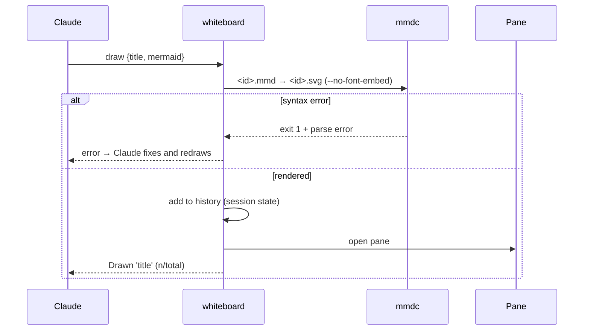

# Claude Code mods

Experiments with **Claude Code mods**: plugins of function hooks that add live panes, bands, status lines, toasts, tools and hooks inside Claude Code (terminal CLI and the desktop Code tab), and hot-reload while you build them.

> The mods API is **early access** and changes between releases. Everything here was built and tested against Claude Code **2.1.286**.

| Mod | What it does |
|---|---|
| [`whiteboard/`](whiteboard) | Gives Claude a `draw` tool: Mermaid diagrams (UML class, sequence, state, ER, flowcharts, gantt, C4-style) rendered locally and shown in a side pane, with history, export and copy. |

---

## Whiteboard

Ask Claude for a diagram — *"show me the auth flow as a sequence diagram"*, *"draw the class structure of this module"* — and it appears in a **Whiteboard** pane beside the conversation, rendered locally by [mermaid-cli](https://github.com/mermaid-js/mermaid-cli). Nothing leaves your machine.

```
◀  3/5  ▶   Checkout sequence          [Export] [Copy] [Open]
┌──────────────────────────────────────────────────────────┐
│  desktop / VS Code: the rendered SVG on a white card     │
│  terminal: the Mermaid source in a code block            │
└──────────────────────────────────────────────────────────┘
```

### Features

- **`draw` tool for Claude** (`mcp__whiteboard__draw`, input `{ title, mermaid }`). Rendering happens before the tool returns, so a Mermaid syntax error goes straight back to Claude, which fixes the source and redraws in the same turn. Failed renders never enter history.
- **History** of the session's last 20 diagrams: ◀ ▶ buttons, or `h` / `l` while the pane has focus.
- **Export** writes `diagrams/<title-slug>.mmd` and `.svg` into the session's working directory (adds `-2`, `-3`… instead of overwriting).
- **Copy** puts the Mermaid source on the clipboard; **Open** (`o`) opens the SVG in your default app.
- **`/whiteboard`** opens the pane whenever you want it.

### Where it works

| Surface | What you see |
|---|---|
| Desktop Code tab | Rendered SVG, history, Export / Copy / Open |
| VS Code extension | Same as desktop |
| Terminal (iTerm2, Terminal.app, …) | Mermaid source + **Open** to view the SVG in your browser |

In the terminal a pane opens by itself only in the fullscreen layout at ≥ 144 columns; otherwise run `/whiteboard`.

### Requirements

- Claude Code with function-hook mods (built on 2.1.286)
- Node.js and mermaid-cli:

  ```bash
  npm i -g @mermaid-js/mermaid-cli
  ```

  The mod finds `mmdc` through your login shell (`zsh -lc 'command -v mmdc'`), then falls back to the newest `~/.nvm/versions/node/*/bin/mmdc`, so nvm installs work even when the desktop app's `PATH` doesn't include them. If neither finds it, set the plugin option **`mmdcPath`** to the absolute path.

### Install

Clone the repo, then load the plugin folder.

For one session:

```bash
claude --plugin-dir /path/to/claude-code-mods/whiteboard
```

For every session (CLI and desktop), add it to the `env` block of `~/.claude/settings.json`:

```json
{
  "env": {
    "CLAUDE_CODE_PLUGIN_DIRS": "/path/to/claude-code-mods/whiteboard"
  }
}
```

### How it works



- Rendered files live in `$TMPDIR/claude-whiteboard/<session-id>/`; session state holds only metadata.
- Mermaid text only ever goes into a file, never onto a command line, and `mmdc` runs by argv, without a shell.
- `--no-font-embed` keeps SVGs small: mermaid-cli 12 otherwise inlines ~160 KB of web fonts, past the 128 KB the pane draws inline. Text falls back to Arial.

### Layout

```
whiteboard/
  .claude-plugin/plugin.json   manifest, `mmdcPath` option
  hooks/register.tsx           engine wiring: tool, command, pane, buttons
  hooks/history.ts             pure history logic
  hooks/render.ts              pure rendering helpers (argv, env, error parsing)
  hooks/actions.ts             pure pane helpers
  hooks/*.test.ts(x)           claude plugin test suites
  hooks/testkit.ts             fake host for the tests
  types/index.d.ts             session-state contract
  scripts/smoke-mmdc.sh        renders with the real mmdc
```

### Development

```bash
claude plugin validate whiteboard   # what the engine will load, call and refuse
claude plugin test whiteboard       # 49 tests, terminal + desktop surfaces
whiteboard/scripts/smoke-mmdc.sh    # real mmdc: renders, size limit, syntax errors
```

### Known limitations

- Mermaid's state-diagram grammar is lenient: some typos render as odd states instead of failing.
- No inline image in kitty / Ghostty yet (the terminal shows source + Open).
- Sources longer than ~9,800 characters show truncated in the source view (Copy / Export still give the full text).
- Interrupting Claude doesn't stop a running render; the 20 s timeout bounds it.

---

## Notes on the mods API (learned the hard way)

Useful if you're writing your own mod. These are things the type declarations don't spell out up front:

- **`$` can only be passed to functions declared at the top level of the same file.** Helpers in other files must be pure; the engine refuses to load the module otherwise.
- **Never name a variable `h`.** JSX compiles to bare `h(...)` calls, and a local `h` shadows the factory.
- **`Text`, `Svg` and `Markdown` drop a `key` prop.** Tests find them by type and text; `Button`s keep their keys.
- **The terminal's element table includes an `Svg` that draws nothing.** Pick the body by `e.surface`, not by `'Svg' in elements`.
- **Relative `$.fs` paths resolve against the engine's cwd**, not necessarily the session's: build paths from `$.session.cwd()`.
- **In `claude plugin test`:** the test's `$` carries only engine events (`tool.call`, `ui.mount`, `session.start`…), not plugin calls (`fs`, `env`, `process`), so test through the plugin's own tools and panes. `tool.register` / `command.register` have no implementation there and must be stubbed. A stub that throws is skipped rather than rejected, so answer `{ deny }` instead.

## Design docs

The spec and the implementation plan this was built from are in [`docs/superpowers/`](docs/superpowers).
